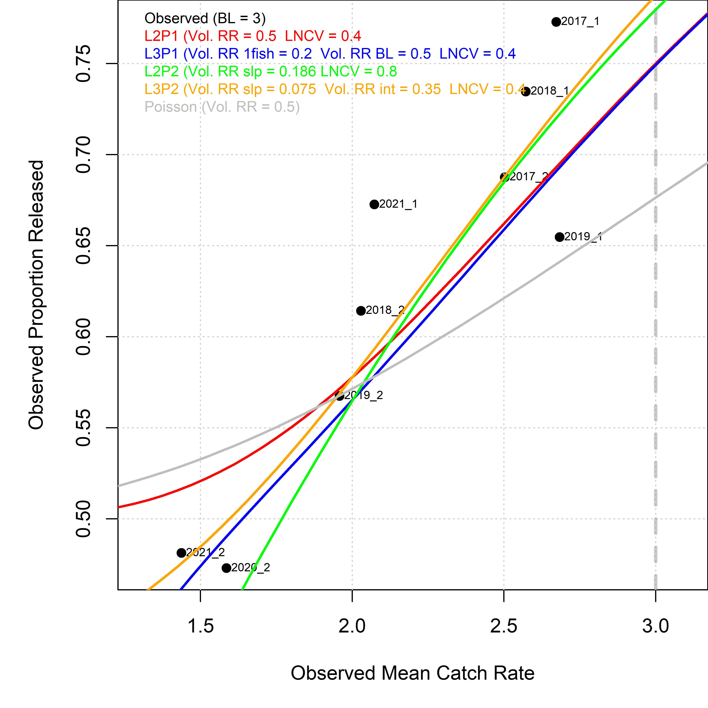
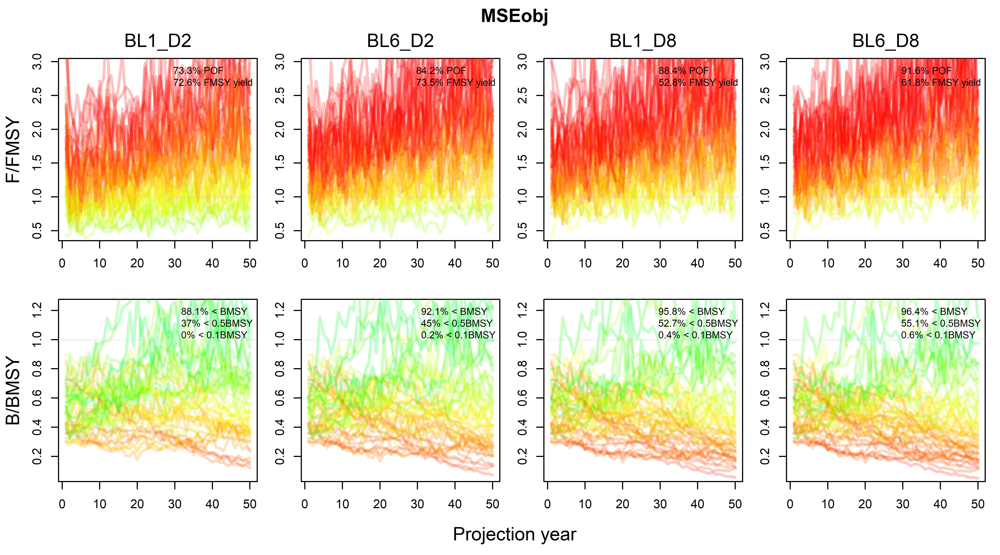
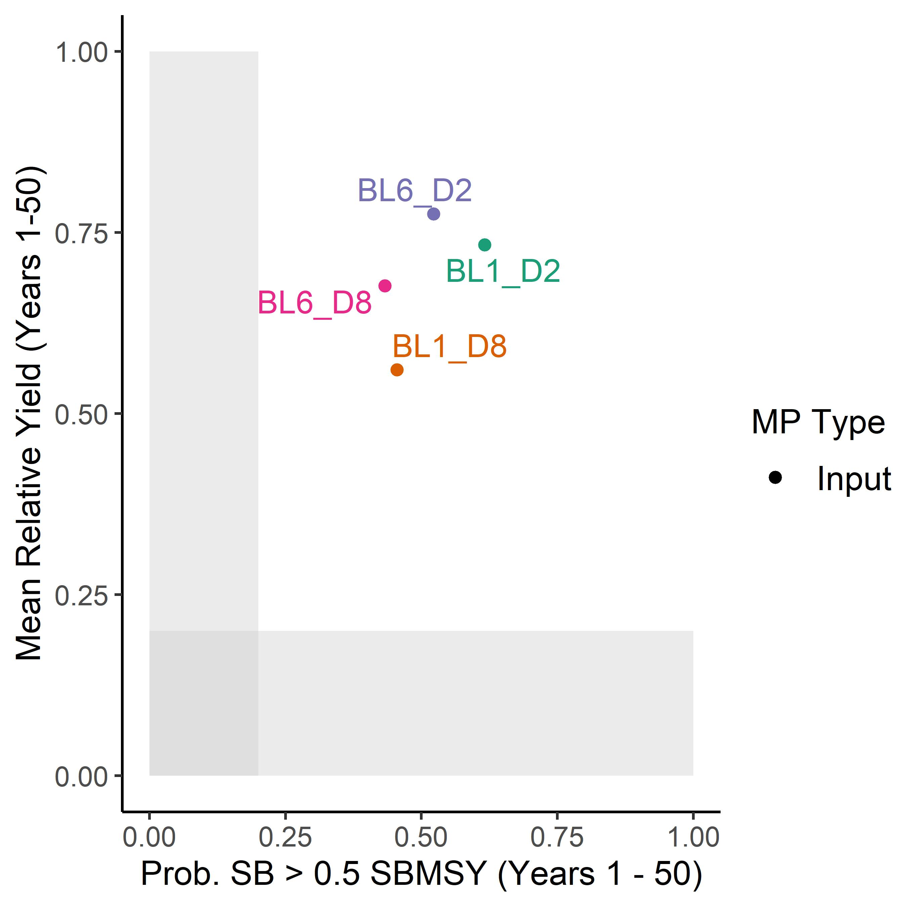

---
title: "Developing Models for Testing Bag Limit Policies in California State Fisheries"
author: "Tom Carruthers <tom@bluematterscience.com>"
date: "`r format(Sys.time(), '%d %B, %Y')`"
output: html_document
---
&nbsp;


<style>
  .col2 {
    columns: 2 200px;         /* number of columns and width in pixels*/
    -webkit-columns: 2 200px; /* chrome, safari */
    -moz-columns: 2 200px;    /* firefox */
  }
  .col3 {
    columns: 3 100px;
    -webkit-columns: 3 100px;
    -moz-columns: 3 100px;
  }
  .col4 {
    columns: 4 100px;
    -webkit-columns: 4 100px;
    -moz-columns: 4 100px;
  }
</style>

***


***

&nbsp;


***

```{r setup, include=FALSE}
library(dplyr)
library(kableExtra)
library(readxl)
library(DT)

knitr::opts_chunk$set(echo = FALSE)
# setwd("C:/Users/tcarruth/Documents/Github/CaliBL/docs")


getprojectinfo<-function(page,addcol=F,dummy=F){
  tab=as.data.frame(read_excel("Project_Info/Status Assumptions To do.xlsx", sheet = page))
  tab[is.na(tab)]=""
  dt<-datatable(tab,caption=NULL,options(dom='t'),rownames = F )  
  if(addcol){
    nbk <- 100
    j = ncol(tab)
    brks <- seq(0,100,length.out=nbk)
    y <- round(seq(255, 40, length.out = nbk + 1), 0)
    clrs <- rainbow(nbk + 1, start=0.05,end=0.3)
    dt <- DT::formatStyle(dt, j, backgroundColor = DT::styleInterval(brks, clrs))
  }
  if(!dummy)return(dt)
}

```

&nbsp;

### Disclaimer

The following work is preliminary and intended to elicit feedback on data, modelling and other aspects of implementing bag limit regulations in MSE for California state fisheries. 

None of these results are final. 

These analyses do not necessarily reflect the point of view of CDFW, RLF or other funders, and in no way anticipate future policy in this area.

***

### Objective

Based on observed recreational catch rate and release rate data, develop theoretical models for at least two species of California state fisheries that predict release rates given alternative bag limit policies, and incorporate these into the open-source [openMSE](https://openmse.com/) framework for testing management procedures.  

***

### Project details

```{r ProjDets, eval=T}
dat<-data.frame(c("Term","Funding body","Funding stream","Contract No.","Project Partners","Blue Matter Team","CDFW Principal Investigators"),
                
                 c("Jan 1 2023 - September 30 2023",
                   "Resources Legacy Fund (RLF)",
                   "FIS",
                   "17037",
                   "Blue Matter Science Ltd.",
                   "Tom Carruthers, Adrian Hordyk",
                   "Julia Coates"))

kable(dat,"simple",col.names=rep("",2)) 
 

```


***

### Introduction

Recreational fisheries are a substantial contributor to overall fishery exploitation in a number of California state fisheries. For example, over recent years the recreational fishery for Northern California Halibut constitutes roughly 40% of the total catches. 

Individual angler bag limits and boat limits remaing a primary management measure for recreational fisheries. When evaluating the performance of alternative management policies that vary bag limits it is necessary to account for the impacts on yields and biological risk due to post-release mortality. 

CDFW has begun the process of implementing Management Strategy Evaluation for various fisheries ([CDFW 2023a - Data Limited Fisheries Management](https://wildlife.ca.gov/Conservation/Marine/Data-Limited-Fisheries), [Hordyk et al. (2017)](https://www.datalimitedtoolkit.org/wp-content/uploads/2017/07/Applying-MSE-to-CA-Fisheries-Case-Studies-Recommendations.pdf)
, [Valencia et al. 2021](https://nrm.dfg.ca.gov/FileHandler.ashx?DocumentID=195538&inline)). 

Preliminary multi-sex, multi-fleet operating models were developed for California Halibut using the [openMSE](www.openMSE.com) framework ([CDFW 2023b - California Halibut Enhanced Status Report](https://marinespecies.wildlife.ca.gov/california-halibut/), [CDFW 2023c - California Halibut](https://wildlife.ca.gov/Conservation/Marine/Nearshore#56021327-california-halibut)). To rigorously account for bag limit impacts on the stock and fishery it is necessary to build openMSE-compatible management procedures that realistically account for these dynamics. 

This first phase of the project (Deliverable A) derives such a bag-limit-release-rate model (e.g. [Carruthers et al. (2019) - Landscape Scale Trout Management](References/Carruthers et al Landscape Recreational Fisheries cjfas-2018-0168.pdf)
, [Porch & Fox (1990) - Simulating Bag Limits](References/Simulating_bag_limits_Porch.pdf), [Fisher (2012) - PhD thesis inc Bag Limit theory](References/Fisher_PhD.pdf)) from empirical data and demonstrates this for an example Halibut operating model. 

Following projects steps will refine data inputs, fine-tune the derived bag-limit-release-rate models, and construct fully featured multi-fleet operating models from recent stock assessments of California Halibut. The approach will then be extended to at least one additional species. 


***


### Project Status

The project is currently on-schedule.

&nbsp;

#### Deliverables

This project page and the code and information linked from it, are intended to satisfy Deliverable A. 

```{r Deliv, eval=T, results='asis'}
getprojectinfo("Status",T,T)
getprojectinfo("Status",T)

```

&nbsp;

#### Tasks

Tasks A - C require further scrutiny and collaboration with CDFW scientists. These will reach 100% completion when data, release-rate models and operating models have been refined further. 

```{r Tasks, eval=T, results='asis'}
getprojectinfo("Tasks",T)
```

&nbsp;

#### Priorities

The key priorities rely on getting confidentiality agreements in place to obtain location-based Recfin data so that regional bag limits can be related to regional catch rate and release rate data. 

```{r Priorities, eval=T, results='asis'}
getprojectinfo("ATD")
```


***
&nbsp;

### Preliminary Findings for Halibut

#### Statistical distributions for recreational CPUE

Recreational catch rate recorded in the [Recfin](http://wiki.recfin.org/index.php/California_Recreational_Fisheries_Survey) database suggests that trip-level observations are log-normally distributed (see biannually disaggregated data of Figure 1).

The Poisson model most commonly applied to approximate release rates (e.g. [Carruthers et al. (2019) - Landscape Scale Trout Management](References/Carruthers et al Landscape Recreational Fisheries cjfas-2018-0168.pdf)
, [Porch & Fox (1990) - Simulating Bag Limits](References/Simulating_bag_limits_Porch.pdf), [Fisher (2012) - PhD thesis inc Bag Limit theory](References/Fisher_PhD.pdf)), did not fit the observed data well. 

&nbsp;


Figure 1. Distribution of trip-level catch rate in the [Recfin](http://wiki.recfin.org/index.php/California_Recreational_Fisheries_Survey) database. Log-normal distributions (red) were fitted to the data (black) and lognormal mean and standard deviation calculated. Data are disaggregated biannually (For example, 2017_1 is Jan-Jun 2017, 2019_2 is Jul-Dec 2019). 

&nbsp;

#### Fit to data of alternative release rate models

Multiple models were derived that could predict release rate given observed catch rate and the applied bag limit (e.g. 3 fish per-trip-per-person in the case of Northern Halibut):

* (L2P1) A 2-parameter log-normal model that estimates the variance of the log-normal distribution and the background voluntary release rate (independent of release rate due to the bag limit)

* (L3P1) A 3-parameter log-normal model that is the same as L2P1 but estimates background voluntary release rate for mean CPUE above and below 1 fish per trip. 

* (L2P2) A 2-parameters lognormal model that is the same as L2P1 but estimates the slope in increasing background voluntary release rate with mean CPUE (origin = 0:0)

* (L3P2) A 3-parameter lognormal model that is tthe same as L2P2 but also estimates the intercept in background voluntary release rates (release rate at zero CPUE)

* (Poisson: for reference) A one parameter Poisson model that simply estimates the background voluntary release rate. 

The Poisson model (grey line) could not achieve the desired increase in release rate with increasing catch rates due to assuming too high a variance in observed catch rates (variance = mean).

The 2-parameter log normal distribution model that estimates a constant background rate of voluntary releases (L2P1, red line) cannot fit the relatively low release rates at low observed mean catch rate. 

The 3-parameters log normal distribution model that estimates voluntary release rates given mean catch rate below 1 fish per trip and then a another voluntary release rate for mean catch rates above 1 fish (L3P1, blue line), did a better job but was consistently below the true observations. 

The 2-parameter log normal distribution model that estimates a linearly increasing rate of background voluntary releases (L2P2, green line) could not fit the lower release proportions that were observed at lower mean catch rates. 

The 3-parameter log normal distribution model that estimates linearly increasing rate of background voluntary releases from an intercept (L3P2, orange line) fitted the data the best with fewer patterns in residuals (observed - model predicted).  

&nbsp;



Figure 2. Fit of alternative release models to historical observed mean catch rate and observed proportion released.  

&nbsp;

#### Demonstration projections

A total of 18 bag-limit MPs were developed to demonstrate the compatibility of the 3-parameter log normal model (L3P2) with openMSE. These 18 MPs are a full cross of 6 bag limits (1 - 6) and three levels of post-release mortality rate (20%, 50% and 80%). For example BL3_D2 is a 3-bag limit management option assuming a 20% post release mortality rate, BL6_D5 is a 6-fish bag limit management options assuming a 50% post-release mortality rate. In all of these MPs we assume current fishing effort is held constant at current levels. 

Due to the current inability of the r4ss R package to read the Southern California Halibut SS3 assessment, an older more generic [California Halibut operating model](https://docs.google.com/viewer?url=https://github.com/Blue-Matter/OM_library/raw/main/OM_case_studies/California_Halibut_CA_CDFW/California_Halibut_CA_CDFW.pdf) was used in this demonstration. 

The observed catch rate data were added to the operating model and linked to vulnerable biomass. This means that a future index of catch rate is simulated and passed to the MPs under projection. The MPs can then do the appropriate release rate calculations in closed-loop. To make sure that the catch rates of the operating model were known perfectly, the index was simulated with no error. 

When a multi-fleet operating model is available (solving the r4ss issue above) the release rate calculations will apply to the recreational fleet only. For the older, more generic, combined fleet operating model, it is assumed that recreational catches are 40% of the total catches (i.e., bag limits are effectual on only 40% of the exploitation rate in any year). 

Projecting four extreme MPs (bag limits of 1 and 6 crossed with post release mortality rates of 20% and 80%) demonstrates that bag limits could be influential. When post release mortality rate is low (BL1_D2, BL6_D2) increasing the bag limit to 6 fish increased the probability of overfishing by 11% in total across all fishery types, (Figure 3). Biological risk was increased (P(B<0.5BMSY)) by 8%. 

When post release mortality rate is high (BL1_D8, BL6_D8), probability of overfishing was broadly similar, as was biological risk. However, overall yields were 9% higher in the case of the 6-fish bag limit, equivalent to a 22.5% increase for the recreational component (9/40). 




Figure 3. Projection plots of F/FMSY and B/BMSY (SSB/SSBMSY) for the four MPs (50 simulations).

&nbsp;

Trade-off plots (Figure 4) of biomass risk and yield show that bag limits have an impact on yield (vertical distance) when post release mortality rate is high (BL1_D8 vs BL6_D8) and a impact on biomass risk (horizontal distance) when post-release mortality rate is low (BL1_D2, BL6_D2). 



Figure 4. Trade-off plots (Figure 4) of biomass risk and yield for the four MPs (64 simulations).


&nbsp;

***

### Code to Run an Example

The code has been organized in a dedicated R package hosted on a public GitHub repository [CaliBL](https://github.com/Blue-Matter/CaliBL). This makes downloading MPs and operating models relatively simple. 

Installation:

```{r packageinstall,echo=T, eval=FALSE}
install.packages(openMSE)
install.packages(devtools)
devtools::install_github('blue-matter/CaliBL')
packageVersion('CaliBL')

```

Run the example code to produce the plots above:

```{r rundemo,echo=T, eval=FALSE}
library(CaliBL)
avail('MP')
avail('OM')
MSEobj = runMSE(DemoOM,MPs=c('BL1_D2',"BL6_D2","BL1_D8","BL6_D8"))
Pplot(MSEs,maxsims=50)              # Figure 3
TradePlot(MSEobj,"P50","Yield")     # Figure 4

```


***

### Software and Code 

[CDFW_Bag_Limit GitHub repository](https://github.com/blue-matter/CDFW_Bag_Limits)

[openMSE (MSEtool, DLMtool, SAMtool R libraries)](https://openMSE.com)


***

### References

[Carruthers et al. (2019) - Landscape Scale Trout Management](References/Carruthers et al Landscape Recreational Fisheries cjfas-2018-0168.pdf)

[CDFW 2023a - Data Limited Fisheries Management](https://wildlife.ca.gov/Conservation/Marine/Data-Limited-Fisheries)

[CDFW 2023b - California Halibut Enhanced Status Report](https://marinespecies.wildlife.ca.gov/california-halibut/)

[CDFW 2023c - California Halibut](https://wildlife.ca.gov/Conservation/Marine/Nearshore#56021327-california-halibut)

[Fisher (2012) - PhD thesis inc Bag Limit theory](References/Fisher_PhD.pdf)

[Hordyk 2020](https://openmse.com/multi-mse/cdfw_multimse)

[Hordyk et al. (2017)](https://www.datalimitedtoolkit.org/wp-content/uploads/2017/07/Applying-MSE-to-CA-Fisheries-Case-Studies-Recommendations.pdf)

[Porch & Fox (1990) - Simulating Bag Limits](References/Simulating_bag_limits_Porch.pdf)

[Valencia et al. 2021](https://nrm.dfg.ca.gov/FileHandler.ashx?DocumentID=195538&inline)

***

### Acknowledgements

Special thanks to Julia Coates for her help in providing and explaining the various datasets.

This work was funded by the [Resources Legacy Fund](https://resourceslegacyfund.org/) - many thanks to Huff McGonigal for coordinating support for this project. 


***

&nbsp;&nbsp;&nbsp;&nbsp;&nbsp;&nbsp;&nbsp;&nbsp;&nbsp;&nbsp;&nbsp;&nbsp;

